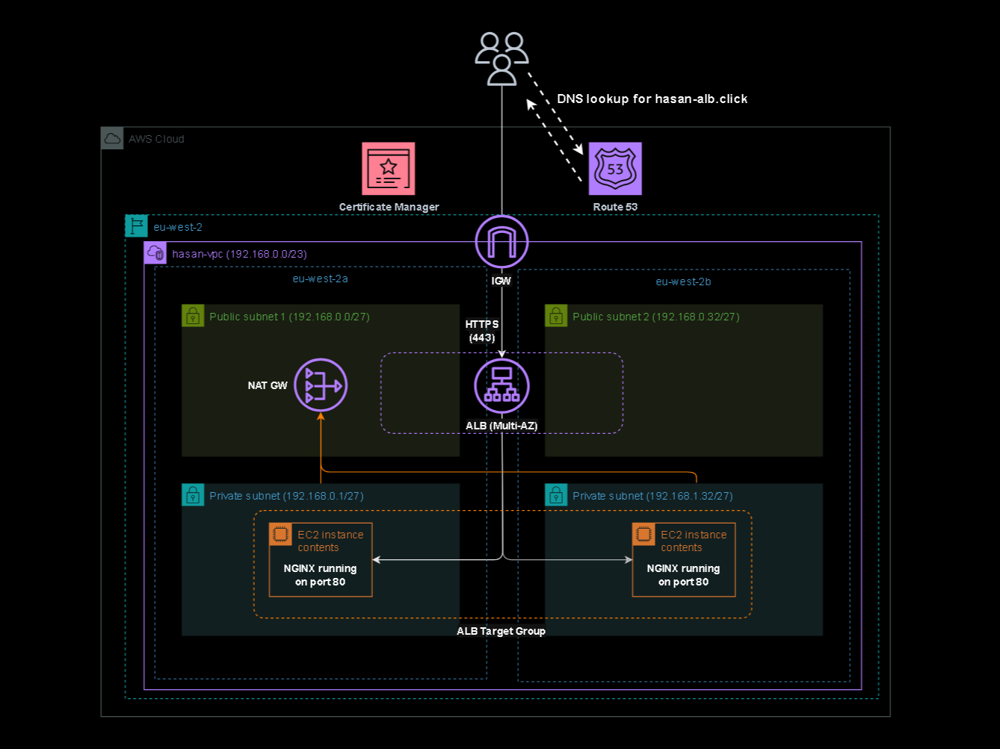

# AWS VPC Architecture with Load Balancing

  

This project is a production-style AWS environment designed and built from scratch. It runs inside a custom VPC with public and private subnets, an Application Load Balancer (for HTTP/S traffic), and NGINX servers hosted privately behind it. Private instances can reach the internet securely via a NAT Gateway.

The goal was to learn how real architectures are deployed end to end with security, routing, DNS, certificates, and isolation between tiers.

## What the Architecture Includes

### Networking
- Custom VPC with two Availability Zones in the `eu-west-2` region (`eu-west-2a` / `eu-west-2b`)
- Public and private subnets  
- Separate route tables for each subnet control how traffic flows.
- Internet Gateway used to allow internet access for public subnets
- NAT Gateway allowing private servers to reach the internet when required
- Private layer isolated from the internet  

### Compute Layer
- Two EC2 instances running NGINX on port 80
- Deployed in private subnets across different AZs  
- No public IP addresses  
- Only accessible through the load balancer

### Load Balancing
- Application Load Balancer placed in the public subnets  
- Handles HTTP and HTTPS traffic  
- Performs health checks and spreads the traffic across both backend servers  
- Can scale horizontally if more instances are added

### DNS and SSL

**Route 53 Hosted Zone**

| Record Name                      | Type  | Alias | Points To / Value                                                      | Purpose |
|---|---|---|---|---|
| hasan-alb.click                  | A     | Yes   | Application Load Balancer (dualstack)                                  | Routes user traffic to the ALB |
| hasan-alb.click                  | NS    | No    | AWS nameservers                                                         | Delegates DNS for the domain |
| hasan-alb.click                  | SOA   | No    | Standard AWS SOA configuration                                          | Provides DNS zone metadata and authority information |
| _acm-validation.hasan-alb.click  | CNAME | No    | ACM validation record                                                   | Allows ACM to verify and issue the SSL certificate |

- Route 53 hosting the public domain  
- ACM handling SSL certificates  
- HTTPS termination at the load balancer, keeping user traffic encrypted until it reaches the load balancer

### Security Setup

**Security Group: Private Instances**

| Rule | Protocol | Port | Source | Description |
|---|---|---|---|---|
| sg-rule-1 | TCP | 80 | ALB Security Group | Allow HTTP traffic from the Application Load Balancer |
| sg-rule-2 | TCP | 22 | Bastion Security Group | Allow SSH access only from the bastion host |

> [!NOTE]
> *No rule for inbound HTTPS as HTTPS is termianted and forwarded as HTTP within the private network*

**Security Group: Application Load Balancer**

| Rule | Protocol | Port | Source | Description |
|---|---|---|---|---|
| sg-rule-1 | TCP | 80 | 0.0.0.0/0 | Allow HTTP traffic from the internet |
| sg-rule-2 | TCP | 443 | 0.0.0.0/0 | Allow HTTPS traffic from the internet |

- Security Groups keep access restricted and intentional
- No direct SSH or web access to private servers  
- Bastion access when needed  
- Separation of public and private layers, mirroring real production standards

---

## How It Works

1. A user visits the public domain managed by Route 53  
2. HTTPS traffic arrives at the ALB, which is configured with an SSL certificate from ACM  
3. The ALB checks which backend instances are healthy by conducting regular health checks
4. Requests are sent to one of the NGINX servers in the private subnets (internally via HTTP)
5. Responses travel back through the same path without the user ever seeing the internal layout

---

## Troubleshooting

During the build, a couple of issues came up that are worth noting. Both were investigated using a temporary bastion host to SSH into the private instances.

Initially, the ALB reported unhealthy targets for two main reasons:
  1. NGINX wasn’t installed because the user data script used the wrong package manager for Amazon Linux.
  2. The EC2 user data script didn’t run properly at first because DNS hostnames and DNS resolution weren’t enabled for the VPC. Once these were enabled, the script executed correctly, NGINX was installed, and health checks passed.

These issues highlighted the importance of verifying instance setup, network dependencies, and the correct use of automated scripts before relying on them in production.

---

## Why I Built It

I wanted A hands-on understanding of:

- The configuration and management of Application Load Balancers, and how they work in a production-style setup
- How multi-tier architectures actually fit together  
- Designing for resilience across multiple AZs
- Keeping security front and centre from the start 
- Building something more realistic than the usual demos

---

## Next Steps

- Automate the deployment using Terraform  
- Possibly replace the EC2 tier with containers to compare architectures  
- Add CloudWatch monitoring and alarms
